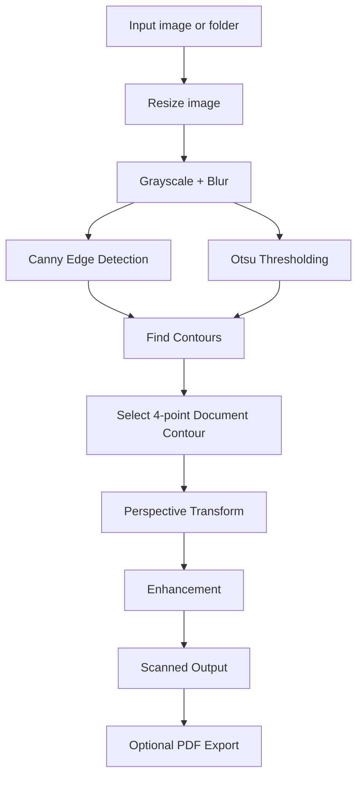

# Doc Vision - A Computer Vision Based Document Scanner

Doc Vision is a computer vision project that transforms casual photos of notes, assignments, and printed documents into clean, scan-like images. I built this project to solve a common student problem where captured images suffer from skew, shadows, and poor readability.

This project uses **classical computer vision with OpenCV**, making it lightweight, fast, and easy to run on a normal laptop without requiring heavy deep learning models.

---

## Problem Statement

Students often capture notebook pages, assignments, and printed documents using mobile cameras. These images are usually:

* tilted or perspective-distorted
* affected by uneven lighting
* difficult to read or share
* not suitable for direct submission

The goal of this project is to automatically detect document boundaries, correct perspective, enhance readability, and optionally generate a PDF.

---

## Why this project matters

I built this project to address a real-life student problem. Clean digital documents are useful for:

* organizing notes
* sharing study material
* submitting assignments
* creating readable archives

---

## Core Computer Vision Concepts Used

This project applies important computer vision concepts such as:

* image preprocessing
* grayscale conversion
* Gaussian blurring
* Canny edge detection
* thresholding
* contour detection
* polygon approximation
* perspective transformation
* morphological operations
* image enhancement

---

## Project Workflow



---

## Features

* Scan a **single image**
* Scan **multiple images from a folder**
* Save **intermediate/debug outputs**
* Export a **combined PDF**
* Simple **Streamlit web interface**
* Includes sample inputs for testing

### Sample input


### Scanned output


---

## Repository Structure

```text
byop_cv_project/
├── app.py
├── streamlit_app.py
├── requirements.txt
├── README.md
├── LICENSE
├── .gitignore
├── src/
│   ├── document_scanner.py
│   └── pdf_utils.py
├── scripts/
│   └── generate_sample_inputs.py
├── assets/
│   ├── sample_inputs/
│   └── sample_outputs/
└── report/
    ├── project_report.md
    └── project_report.docx
```

---

## Setup Instructions

### 1. Clone the repository

```bash
git clone <your-repo-link>
cd byop_cv_project
```

### 2. Create a virtual environment

```bash
python -m venv .venv
```

Activate it:

**Windows:**

```bash
.venv\Scripts\activate
```

**Mac/Linux:**

```bash
source .venv/bin/activate
```

### 3. Install dependencies

```bash
pip install -r requirements.txt
```

---

## How to Run

### Run on a single image

```bash
python app.py --input path/to/image.jpg --output outputs --debug
```

### Run on multiple images

```bash
python app.py --input assets/sample_inputs --output outputs --debug --make-pdf
```

### Run the Streamlit app

```bash
streamlit run streamlit_app.py
```

---

## My Improvements

* Built an end-to-end document scanning pipeline using OpenCV
* Added both CLI and Streamlit interface for usability
* Implemented PDF export functionality
* Structured the project for clarity and scalability

---

## Limitations

* Performance drops with cluttered backgrounds
* Strong shadows may affect output quality
* Only rectangular documents are supported
* Occlusions (like hands) can interfere with detection

---

## Future Improvements

* Manual corner correction
* OCR integration for searchable PDFs
* Mobile app version
* Shadow removal techniques
* Real-time scanning via webcam

---

## Author

**Akshaansh Veer**
Roll No: 23BAI10730
Prepared as a BYOP capstone project for the **Computer Vision** course.


This project was developed as a practical implementation of computer vision concepts, focusing on solving real-world document scanning challenges efficiently.
