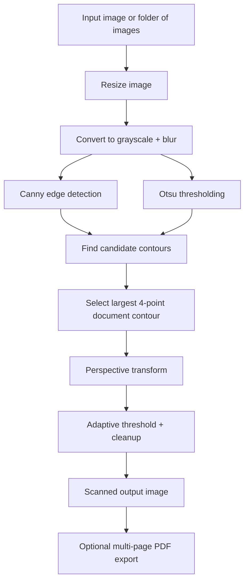
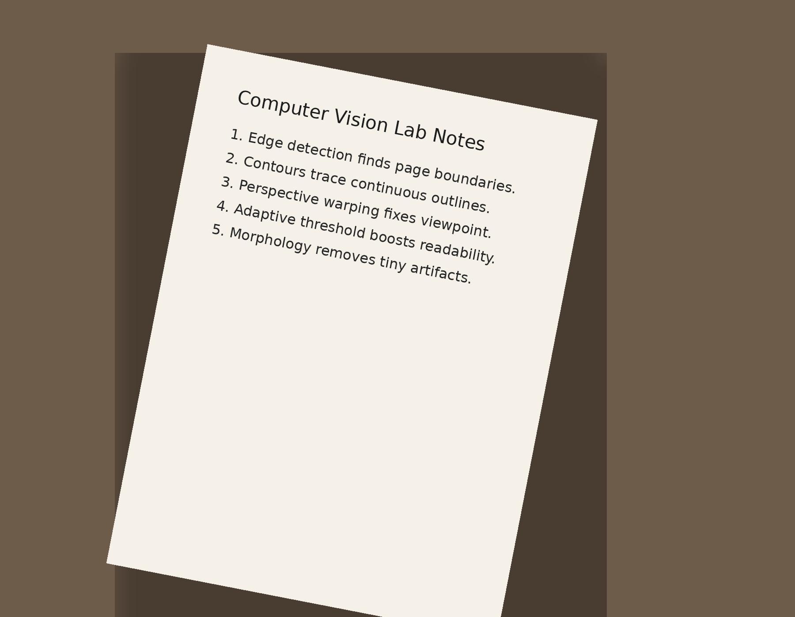
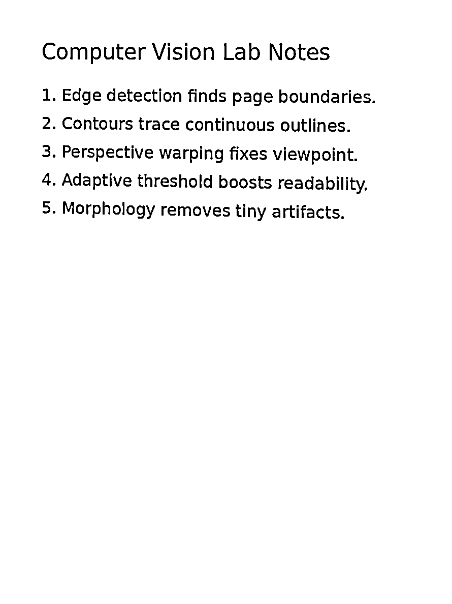

# SmartDoc Vision - A Computer Vision Based Document Scanner

SmartDoc Vision is a practical computer vision project that turns casual phone photos of notes, assignments, and printed pages into clean scan-like images. The project is designed for students who often click pictures of handwritten notes and later struggle with skew, shadows, perspective distortion, and poor readability.

This project uses **classical computer vision with OpenCV** instead of heavy deep learning so it is lightweight, explainable, fast, and easy to run on an ordinary laptop.

---

## Problem Statement

Students frequently capture notebook pages, class notes, assignment sheets, and printed documents using mobile cameras. These images are often:

- tilted or perspective-distorted
- affected by uneven lighting
- hard to read or archive
- unsuitable for direct PDF submission

The goal of this project is to detect the document boundary automatically, correct the perspective, enhance the page, and optionally combine multiple scanned pages into a PDF.

---

## Why this project matters

This is a real problem from everyday student life. A clean digital copy of notes or assignments is useful for:

- archiving class notes
- sharing handwritten material with friends
- submitting assignments online
- converting photos into cleaner study material

---

## Core Computer Vision Concepts Used

This project directly applies important course concepts:

- image preprocessing
- grayscale conversion
- Gaussian blurring
- Canny edge detection
- thresholding
- contour detection
- polygon approximation
- perspective transformation
- morphological operations
- image enhancement

---

## Project Workflow



---

## Features

- Scan a **single image**
- Scan **multiple images from a folder**
- Save **debug/intermediate processing outputs**
- Export a **combined PDF** from all scanned pages
- Optional **Streamlit web app** for a simple UI
- Includes **sample images** for demo/testing

---

## Repository Structure

```text
byop_cv_project/
├── app.py
├── streamlit_app.py
├── requirements.txt
├── README.md
├── LICENSE
├── .gitignore
├── src/
│   ├── document_scanner.py
│   └── pdf_utils.py
├── scripts/
│   └── generate_sample_inputs.py
├── assets/
│   ├── sample_inputs/
│   └── sample_outputs/
└── report/
    ├── project_report.md
    └── project_report.docx
```

---

## Setup Instructions

### 1. Clone the repository

```bash
git clone <your-github-repo-link>
cd byop_cv_project
```

### 2. Create and activate a virtual environment

```bash
python -m venv .venv
source .venv/bin/activate
```

On Windows:

```bash
.venv\Scripts\activate
```

### 3. Install dependencies

```bash
pip install -r requirements.txt
```

---

## How to Run

### Run on a single image

```bash
python app.py --input path/to/image.jpg --output outputs --debug
```

### Run on a folder of images

```bash
python app.py --input assets/sample_inputs --output outputs --debug --make-pdf
```

### Launch the Streamlit app

```bash
streamlit run streamlit_app.py
```

---

## Example Output

### Sample input



### Scanned output



---

## Important Files

### `src/document_scanner.py`
Contains the full document scanning pipeline:
- preprocessing
- contour detection
- point ordering
- perspective correction
- scan enhancement

### `src/pdf_utils.py`
Combines multiple scanned images into a single PDF.

### `app.py`
Command-line interface for running the project.

### `streamlit_app.py`
Optional browser-based UI for uploading an image and downloading the scanned output.

---

## Algorithm Overview

### 1. Resize
The image is resized for faster processing while preserving aspect ratio.

### 2. Preprocessing
The resized image is converted to grayscale and blurred to reduce noise.

### 3. Document candidate extraction
Two parallel signals are used:
- **Canny edges** to capture page boundaries
- **Otsu thresholding** to isolate bright paper regions

### 4. Contour selection
Contours are sorted by area. The best 4-point contour with sufficient area is selected as the document boundary.

### 5. Perspective transform
The four corners are ordered and mapped to a top-down rectangle using homography-based warping.

### 6. Enhancement
The warped image is converted into a clean scan-like result using:
- CLAHE for local contrast improvement
- adaptive thresholding for better readability
- morphological closing for noise cleanup

---

## Results

The project works well when:
- the page is clearly visible
- the background contrasts with the document
- the page is not severely occluded
- the image is not extremely blurred

---

## Limitations

- very cluttered backgrounds can confuse contour detection
- heavy shadows may reduce quality
- non-rectangular documents are not handled
- overlapping objects like hands may break page boundary detection

---

## Future Improvements

- manual corner correction UI
- mobile app version
- OCR integration for searchable PDFs
- shadow removal pipeline
- automatic brightness estimation
- support for real-time webcam scanning
- deep learning based document detector for harder scenes

---

## Learning Outcomes

Through this project, I learned how to connect multiple computer vision ideas into one end-to-end real-world system rather than solving isolated lab exercises. I also learned the trade-off between robustness, simplicity, explainability, and execution speed.

---

## Suggested Git Commit Plan

To make the GitHub repository look like a genuine development process, push in stages such as:

1. `init: create project structure and requirements`
2. `feat: add preprocessing and edge detection pipeline`
3. `feat: add contour-based document detection`
4. `feat: add perspective transform and scanned output`
5. `feat: add pdf export and sample inputs`
6. `docs: add README and project report`
7. `feat: add streamlit demo app`
8. `refactor: clean code and improve comments`

---

## Author

Prepared as a BYOP capstone project for the **Computer Vision** course.
